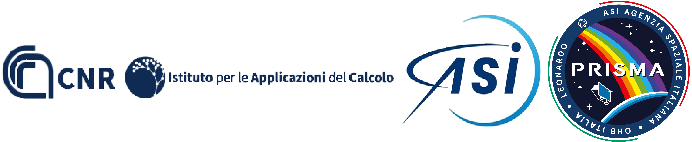
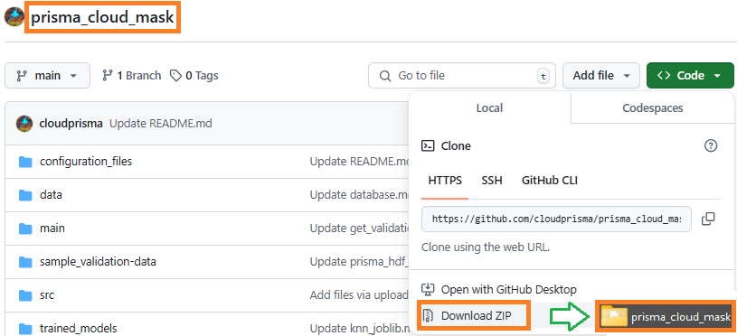
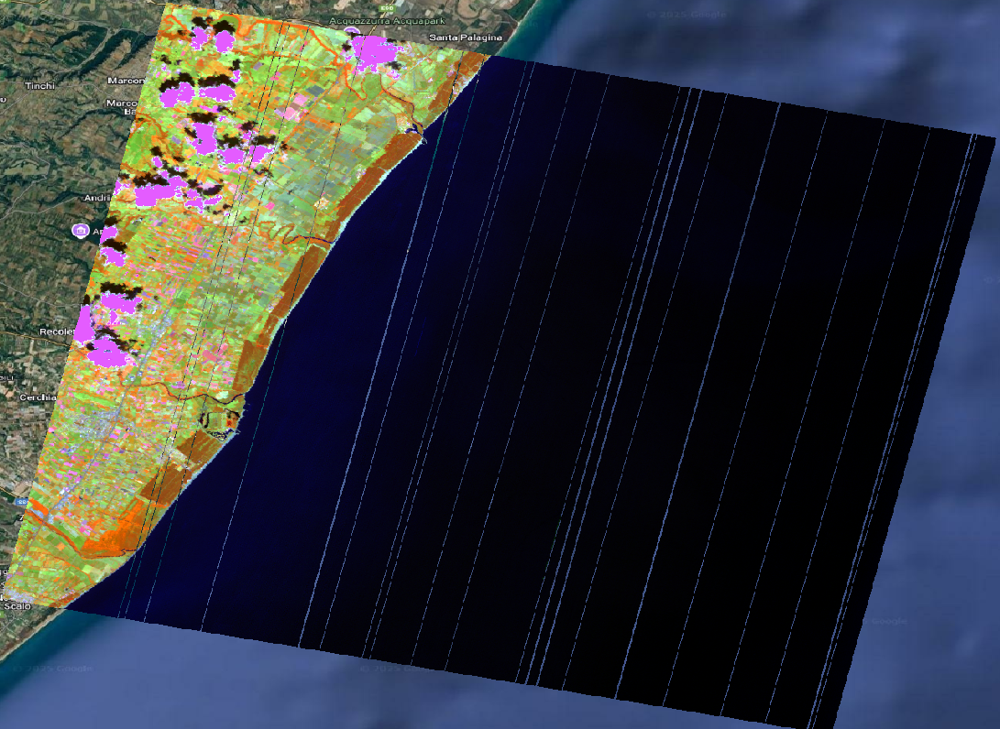

[comment]: # (This is a CommonMark compliant comment. It will not be included in the presentation.)
[comment]: # (Compile this presentation with the command below)
[comment]: # (mdslides presentation.md --include media)

[comment]: # (Set the theme:)
[comment]: # (THEME = white)
[comment]: # (CODE_THEME = base16/zenburn)
[comment]: # (The list of themes is at https://revealjs.com/themes/)
[comment]: # (The list of code themes is at https://highlightjs.org/)

[comment]: # "You can also use quotes instead of parenthesis"
[comment]: # 'Single quotes work too'
[comment]: # "THEME = white"

[comment]: # (Pass optional settings to reveal.js:)
[comment]: # (controls: true)
[comment]: # (keyboard: true)
[comment]: # (markdown: { smartypants: true })
[comment]: # (hash: false)
[comment]: # (respondToHashChanges: false)
[comment]: # (Other settings are documented at https://revealjs.com/config/)

### SAPP4VU: Cloud Mask
----------
Implementazione di algoritmi numerico-statistici per la caratterizzazione e rimozione del rumore e per la cloud detection in immagini iperspettrali.  

<center></center>

March 13, 2025

[comment]: # (!!!) 


### Prisma cloud mask - [GIT](https://github.com/cloudprisma/prisma_cloud_mask/tree/main)
----------
### Description:
<div style="font-size: 1em;">

This repository contains the Python sources of the Prisma basic processing for cloud classification. Some parts for the preprocessing were adapted from the original code developed by [[1]](Vanhellemonthttps://www.sciencedirect.com/science/article/pii/S0034425718303481) - see the [ACOLITE: generic atmospheric correction module - for PRISMA](https://github.com/acolite/acolite) 
</div>

[comment]: # (!!! data-background-color="Lavender")


## Prepare environment
----------
-Example based on linux systems-

[comment]: # (||| data-background-color="Azure")


1. Create an environment, for instance:
```
$ pip install virtualenv
$ python -m venv <virtual-environment-name>
```
or if necessary:
   ```
$ pip3 install virtualenv
$ python3 -m venv <virtual-environment-name>
  ```
[comment]: # (||| data-background-color="Honeydew")

2. Activate your virtual environment:
```
$ source <virtual-environment-name>/bin/activate
```
[comment]: # (||| data-background-color="Honeydew")

3. Install the requirements in the Virtual Environment, you can easily just pip install the libraries. For example:
```
$ pip install numpy
```
  
or  If you use the requirements.txt file:
```
$ pip install -r requirements.txt
```

[comment]: # (!!! data-background-color="Honeydew")

## Download project
----------
-Resources-

[comment]: # (||| data-background-color="FloralWhite")

4. Download the scripts available here and save them into the same directory or try via git clone source:
```
$  git clone https://github.com/cloudprisma/prisma_cloud_mask
```
[comment]: # (||| data-background-color="FloralWhite")

<center></center>
<div style="font-size: 1em;">
Alternative you can download the <a href="https://github.com/cloudprisma/prisma_cloud_mask/archive/refs/heads/main.zip">zip</a>. Please make sure to rename the directory as: <strong>prisma_cloud_mask</strong> after unzip the files.
</div>

[comment]: # (||| data-background-color="LavenderBlush")

<div style="font-size: 1em;">
Given its weight, some files are attached as google drive link. Do not forget to download them:
</div>

[comment]: # (|||data-background-color="Seashell")


  - [Database](https://github.com/cloudprisma/prisma_cloud_mask/blob/main/data/database.md)
  - [sample_validation_data/gpkg/](https://github.com/cloudprisma/prisma_cloud_mask/blob/main/sample_validation-data/gpkg/gpkg_files.md) folder
  - [sample_validation_data/hdf/](https://github.com/cloudprisma/prisma_cloud_mask/blob/main/sample_validation-data/hdf/prisma_hdf_files.md) folder
  - [trained_models/knn.joblib](https://github.com/cloudprisma/prisma_cloud_mask/blob/main/trained_models/knn_joblib.md)


[comment]: # (!!! data-background-color="Seashell")

## Run the scripts 
----------
-To get the Cloud Mask-

[comment]: # (||| data-background-color="WhiteSmoke")

Step 1:
----------
- Configure the [config_getclassification.json](https://github.com/cloudprisma/prisma_cloud_mask/blob/main/configuration_files/config_getclassification.json) file according to the instructions given in this [link](https://github.com/cloudprisma/prisma_cloud_mask/tree/main/configuration_files#config_getclassificationjson).

[comment]: # (||| data-background-color="WhiteSmoke")

#### config_getclassification.json
----------
<div style="font-size: 1em;"> 
This is an example for the configuration file used to classify a new image. It is called by the <strong>get_classification.py</strong> main script. The structure for this file is described below:
</div>

```json
{
    "img_folder": "../hdf/",
    "trained_models_folder": "../trained_models/",
    "output_mask_folder": "../results/",
    "model": "xgboost",
    "stack_tif": true,
    "cloud_prisma": true,
    "npy_matrix": false,
}

```
[comment]: # (||| data-background-color="WhiteSmoke")


#### Mandatory parameters:
----------
<div style="font-size: 1em;">

    
- **img_folder**: path to the images to classify in hdf5 format.

- **trained_models_folder**: path to the trained model in joblib format

- **output_mask_folder**: path to the output directory

- **model**: model to be used, options are: knn, rf (Random Forest) or xgboost
 
 </div>
 
[comment]: # (||| data-background-color="WhiteSmoke")

#### Optional parameters:
----------
<div style="font-size: 1em;">

- **stack_tif**: boolean parameter. If true, the original bands are going to be stacked to the output mask.

- **cloud_prisma**: boolean parameter. If true, the original prisma cloud mask is going to be stacked to the output mask.

- **npy_matrix**: boolean parameter. If true, a numpy array is also generated in the output folder.
 </div>

[comment]: # (||| data-background-color="WhiteSmoke")

Step 2:
----------
- Locate at the directory called: **main** inside of **prisma_cloud_mask** folder. Once there, execute the next command in a terminal, for example, to run the classification script ([get_classification.py](https://github.com/cloudprisma/prisma_cloud_mask/blob/main/main/get_classification.py)), you can run the following line:


```
$ python get_classification.py -i <Path to the config_getclassification.json file>
```
[comment]: # (!!! data-background-color="WhiteSmoke")


### Sample Results

- Result based on:
<strong>PRS_L1_STD_OFFL_20240522095507_20240522095511_0001 - Xgboost </strong>
<center></center>

[comment]: # (!!! data-background-color="Black")
